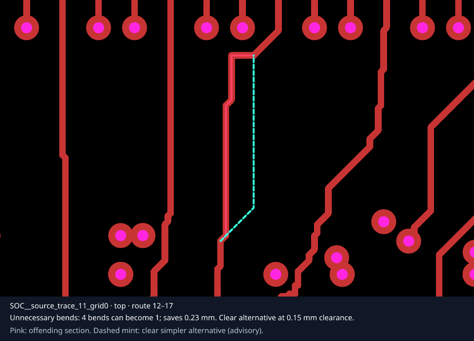

# @tscircuit/check-ugly-traces

Find aesthetically awkward PCB trace sections that have a simpler, locally clear alternative. Accepts Circuit JSON and produces structured findings plus one annotated SVG per finding. Built with `@tscircuit/solver-utils` and `circuit-to-svg`.



Pink highlights the offending section; dashed mint shows the proposed replacement. Images use the original board copper. Silkscreen is omitted from close-ups so labels cannot obscure traces.

## Use

```sh
bun add github:tscircuit/check-ugly-traces
```

```ts
import { checkUglyTraces, writeUglyTracesReport } from "@tscircuit/check-ugly-traces"

const circuitJson = await Bun.file("board.circuit.json").json()
const result = checkUglyTraces({ circuitJson })
console.log(result.findings)

await writeUglyTracesReport({
  circuitJson,
  outputDirectory: "ugly-traces",
})
```

The report directory contains `report.json` and an indexed SVG for each finding. Use the report's `images` list as the authoritative image list for that run. Findings include original route indices, layer, explanation, original and suggested points, width, clearance, and length saved. Circuit JSON is never modified.

Run the standalone report command from this repository:

```sh
bun install
bun run check:ugly-traces tests/fixtures/f1c100s-v0.4.json -o ugly-traces
```

The future `tsci check ugly-traces` handler can compile/load Circuit JSON and call `writeUglyTracesReport`. This repository does not register a command in the separate tscircuit CLI. The standalone command returns 0 for a completed report and 1 for invalid input or execution errors; findings are advisory.

## Detection and fixability

The solver steps through one trace per iteration. It examines same-layer windows of up to six segments and proposes a straight or one-bend octilinear replacement. It reports off-grid angles (more than 3° from a multiple of 45° on segments longer than 0.15 mm) or removable bends saving at least 0.2 mm. Defaults can be configured with `clearance`, `minLengthSaved`, and `maxWindowSegments` (2–32).

Both the replacement and the original section must have room around nearby copper. Clearance includes trace half-width and obstacle radius; the original section requires another 0.05 mm of breathing room. Other same-layer traces, pads, vias, and holes block candidates. Pads use conservative circumscribed circles, vias and holes block all layers, and board edge clearance is respected. Neighbouring connected segments can meet at their shared endpoint but cannot be crossed or doubled back over. Layer transitions, internal port anchors, and width changes are not simplified.

This is a conservative local aesthetic heuristic, not a DRC certificate or an autorouter. It can miss fixable traces near rectangular pads, long detours beyond the search window, and fixes requiring extra bends. Missing rectangular board bounds or custom board outlines prevent suggestions; multiple boards, unsupported pad geometry, copper pours, and keepouts set `skippedUnsupportedGeometry`. Suggested shortening is advisory: timing, impedance, and intentional length matching require design context before applying it.

## Real-board snapshots

All committed visual snapshots are generated from the unmodified deployed Circuit JSON of these real boards:

- [F1C100s v0.4, LCD top/storage right](https://astra--f1c100s-v0-4-0.tscircuit.app/#file=lcd_top_storage_right.circuit.tsx): two findings at default settings.
- [F1C100s v0.5](https://astra--f1c100s-v0-5-0.tscircuit.app/): no findings at default settings; its overview is still snapshot-tested.

`tests/fixtures/sources.json` records direct source URLs and SHA-256 hashes. No visual test uses a fabricated or modified board. Small synthetic fixtures are only used for nonvisual geometric unit tests. SVGs are compared exactly; PNG previews are committed and rendering is exercised in tests without relying on platform-specific font rasterization.

Close-ups pass a padded physical `viewport` to `convertCircuitJsonToPcbSvg`, use its matching coordinate transform for highlights, and extend the SVG `viewBox` to reserve space for the explanation below the crop.

## Develop

```sh
bun install
bun test
bun run typecheck
bun run format:check
bun run start
bun run build:site
# Intentionally regenerate reviewed snapshots:
bun run snapshots:update
```

The Cosmos page provides a `GenericSolverDebugger` for both boards. `UglyTracesSolver` supports `step()`, `solve()`, `getConstructorParams()`, `getOutput()`, progress, stats, and `visualize()`.

Bootstrapped following [the tscircuit handbook](https://github.com/tscircuit/handbook/blob/main/guides/bootstrapping-repos.md): Bun, vanilla TypeScript installation, no lockfile, plop CI templates, and Cosmos. Repository provisioning is declared in [create-repo#72](https://github.com/tscircuit/create-repo/pull/72).
